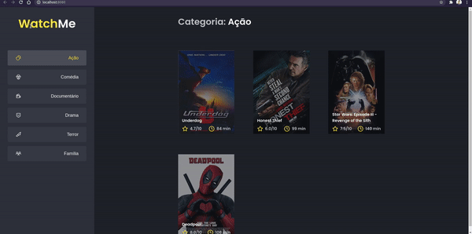
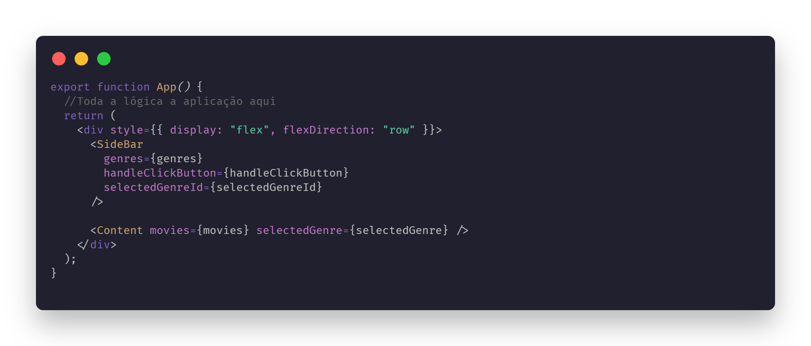

# Desafio 02 - Rocketseat Ignite - React

## 👨‍💻 Sobre este repositório

Esse repositório contém uma pequena aplicação de listagem de filmes por categoria. O código dessa aplicação é baseado em um template que pode ser acessado [aqui](https://github.com/rocketseat-education/ignite-template-componentizando-a-aplicacao).

O projeto é parte dos execícios do curso Ignite da Rocketseat e faz parte da trilha de React. Nesse desafio o objetivo é praticar os fundamentos do React trabalhando com componentes. 

O código do repositório original é completamente funcional e é possível executar rodando `yarn` para baixar as dependências, `yarn server` para executar a FakeAPI e, em outro terminal ao mesmo tempo, `yarn dev` para executar o servidor de aplicação e disponibilizar a página em localhost. 

O arquivo `App.tsx` contém todo o código da aplicação e precisa ser refatorado de forma que a Sidebar e o Content tornem-se componentes. A vantagem dessa estratégia é que toda a lógica, estrutura e estilização de cada parte da página ficam isoladas e podem ser reaproveitadas em outros momentos sem a necessidade de repetir o código.

O resultado esperado no exercício pode ser visto na demonstração abaixo:

Na solução que implementei, passei os parâmetros para cada componente conforme a necessidade que cada um possuia, levando em consideração as devidas tipagens do Typescript e funções da aplicação. O código retornado pelo componente principal `App.tsx` ficou assim: 

